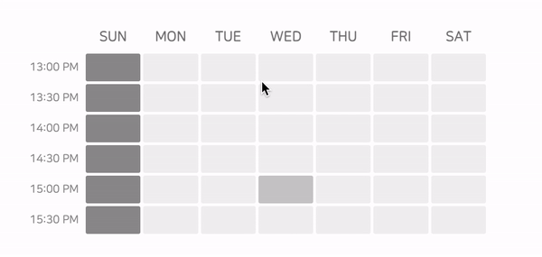

# 🖍 React-Draggable-Selector

<div style="display: flex">
  
  
</div>


### Select with a simple drag, Feel free to style it!

React-Draggable-Selector is a customizable component that allows users to easily select time ranges by dragging. 
This package is for react applications, and uses [styled-components](https://styled-components.com/) for styling and [dayjs](https://day.js.org/en/) for date and time management.

Its main advantages are its intuitive drag-to-select functionality and the freedom to apply custom styling. You can select a time zone by day of the week or by date. Let's get started!

## 🚀 Quick Start

### **1. Installation**

Use npm package manager to install

```bash
$ npm install react-draggable-selector
```

or install with yarn

```bash
$ yarn add react-draggable-selector
```

### **2. Usage**
Take out the component in your React project.

1. When using Javascript:

```jsx
import { useState } from 'react';
import { DraggableSelector } from "react-draggable-selector";

function App () {
  const [dates, setDates] = useState([]);  // required default: []
  const [times, setTimes] = useState([]);  // required default: []

  return (
    <DraggableSelector
      startTime="09:00"                // required
      endTime="18:00"                  // required
      dates={dates}                    // required, required default: []
      selectedTimeSlots={times}        // required, required default: []
      setSelectedTimeSlots={setTimes}  // required
    />
  );
};

export default App;
```

2. When using Typescript:

```tsx
import { useState } from 'react';
import { DraggableSelector } from "react-draggable-selector";

export enum Day {
  SUN = 'SUN',
  MON = 'MON',
  TUE = 'TUE',
  WED = 'WED',
  THU = 'THU',
  FRI = 'FRI',
  SAT = 'SAT',
}

interface TimeSlot {
  date: string;        // ex: '2023/12/24'
  startTime: string;   // ex: '11:00'
  endTime: string;     // ex: '18:00'
  day: Day;            // ex: 'SUN'
}

function App () {
  const [dates, setDates] = useState<Date[]>([]);     // required default: []
  const [times, setTimes] = useState<TimeSlot[]>([]); // required default: []

  return (
    <DraggableSelector
      startTime="09:00"                // required, type: 'string'.
      endTime="18:00"                  // required, type: 'string'
      dates={dates}                    // required, type: 'Date[]', required default: []
      selectedTimeSlots={times}        // required, type: 'TimeSlot[]', required default: []
      setSelectedTimeSlots={setTimes}  // required, type: 'React.Dispatch<React.SetStateAction<TimeSlot[]>>'
    />
  );
};

export default App;
```

### **3. Props**

#### **3.1. Required Props**

| Name (Prop)          | Type                                             | Description                                                                                                   | Default value | Required |
|----------------------|--------------------------------------------------|---------------------------------------------------------------------------------------------------------------|---------------|----------|
| dates                | Date[]                                           | Selected dates, you can making a selection for that date. Required default value is `[]`                      | -             | ✔️       |
| startTime            | string                                           | The start time to display. Type it in 24-hour notation and write it as follows, `09:00`                       | -             | ✔️       |
| endTime              | string                                           | The last time to display. Type it in 24-hour notation and write it as follows, `18:00`                        | -             | ✔️       |
| selectedTimeSlots    | TimeSlot[]                                       | Array of selected time cells. You can also convert the information from output into a Date object and use it. | -             | ✔️       |
| setSelectedTimeSlots | React.Dispatch<React.SetStateAction<TimeSlot[]>> | The setState function of the selectedTimeSlots.                                                               | -             | ✔️       |


#### **3.2. Optional Props**

##### **3.2.1. Control core data**

| Name (Prop) | Type                            | Description                                                                                                                                                                                              | Default value | Required |
|-------------|---------------------------------|----------------------------------------------------------------------------------------------------------------------------------------------------------------------------------------------------------|---------------|----------|
| timeUnit    | 5 \| 10 \| 15 \| 20 \| 30 \| 60 | The time interval for the selector. The amount of time a cell has.                                                                                                                                       | 30            |          | 
| dateFormat  | string                          | Use the date format method of dayjs. You can use the following link to set the formatting form. (https://day.js.org/docs/en/display/format)                                                              | 'M/D'         |          |
| timeFormat  | string                          | Use the time format method of dayjs. You can use the following link to set the formatting form. (https://day.js.org/docs/en/display/format)                                                              | 'HH:mm A'     |          |
| mode        | 'date' \| 'day'                 | Decide whether to indicate all dates or by day of the week. (In the 'day' version) If there is no day of the week corresponding to the selected date, the cell is blocked so that it cannot be selected. | 'date'        |          |
| language    | 'en' \| 'ko'                    | Set the language that will appear in the selector.                                                                                                                                                       | 'en'          |          |


##### **3.2.2. Control selector style**

| Name (Prop)   | Type   | Description                                                                                                               | Default value | Required |
|---------------|--------|---------------------------------------------------------------------------------------------------------------------------|---------------|----------|
| width         | string | The width of the selector. You should assign a string to width, such as `100%`, `500px`, `50vw`, etc.                     | '500px'       |          | 
| height        | string | The height of the selector. You should assign a string to height, such as `100%`, `500px`, `50vh`, etc.                   | 'auto'        |          |
| margin        | string | The margin of the selector. Assign a string to margin, such as `5px 4px 2px 3px`.                                         | '0px'         |          |
| padding       | string | The padding of the selector. Assign a string to padding, such as `5px 4px 2px 3px`.                                       | '0 10px 0 0'  |          |
| minWidth      | string | The minimum width of the selector. You should assign a string to minWidth, such as `100%`, `500px`, `50vw`, etc.          | 'auto'        |          |
| maxWidth      | string | The maximum width of the selector. Assign a string to maxWidth, such as `100%`, `500px`, `50vw`, etc.                     | '100%'        |          |
| minHeight     | string | The minimum height of the selector. Assign a string to minHeight, such as `100%`, `500px`, `50vh`, etc.                   | 'auto'        |          |
| maxHeight     | string | The maximum height of the selector. Assign a string to maxHeight, such as `100%`, `500px`, `50vh`, etc.                   | '500px'       |          |
| scrollWidth   | string | The Thickness of the scroll bar. Assign a string to scrollWidth, such as `3px`, `0.5rem`, `0.5em`, etc.                   | '3px'         |          |
| scrollColor   | string | The color of the scroll bar. Assign a string to scrollColor, such as `#595959`, `#fff`, `rgb(0, 0, 0)`, etc.              | '#595959'     |          |
| scrollBgColor | string | The background color of the scroll bar. Assign a string to scrollBgColor, such as `#e1e1e1`, `blue`, `rgb(0, 0, 0)`, etc. | '#e1e1e1'     |          |


##### **3.2.3. Control slot (cell) style**

| Name (Prop)       | Type   | Description                                                                                             | Default value | Required |
|-------------------|--------|---------------------------------------------------------------------------------------------------------|---------------|----------|
| slotRowGap        | string | The row-gap between each slot. Assign the value in string, e.g. `2px`, `1rem`, `1em`.                   | '3px'         |          | 
| slotColumnGap     | string | The column-gap between each slot. Assign the value in string, e.g. `2px`, `1rem`, `1em`.                | '3px'         |          |
| slotHeight        | string | The height of each slot. Assign the value in string, e.g. `30px`, `1rem`, `1em`.                        | '30px'        |          |
| slotBorderRadius  | string | The border radius of each slot. Assign the value in string, e.g. `10px`, `1rem`, `1em`.                 | '2px'         |          |
| slotBorderStyle   | string | The border style of each slot. Assign the value in string, e.g. `1px solid #000`, `2px dashed #fff`.    | 'none'        |          |
| defaultSlotColor  | string | The color of each slot. Assign the value in string, e.g. `#000`, `#fff`, `#d77373`.                     | '#f1f1f1'     |          |
| hoveredSlotColor  | string | The color of each slot when it is hovered. Assign the value in string, e.g. `#000`, `#fff`, `#d77373`.  | '#cbcbcb'     |          |
| selectedSlotColor | string | The color of each slot when it is selected. Assign the value in string, e.g. `#000`, `#fff`, `#d77373`. | '#3f3f3f'     |          |
| slotMinWidth      | string | The minimum width of each slot. Assign the value in string, e.g. `40px`, `1rem`, `1em`.                 | '40px'        |          |
| disabledSlotColor | string | The color of each slot when it is disabled. Assign the value in string, e.g. `#000`, `#fff`, `#d77373`. | '#939393'     |          |


##### **3.2.4. Control row label (time) style**

| Name (Prop)           | Type    | Description                                                                                                           | Default value      | Required |
|-----------------------|---------|-----------------------------------------------------------------------------------------------------------------------|--------------------|----------|
| rowLabelWidth         | string  | Set the width of the (time Label) row label . If you set it to 0, the row label will not be displayed.                | '68px'             |          | 
| rowLabelBgColor       | string  | Set the background color of each row label (time Label). Applies to each, not to the entire background color.         | 'transparent'      |          | 
| rowLabelPadding       | string  | Set the padding of the (time Label) row label. Applies to each, not to the entire padding. e.g. `10px 20px 10px 20px` | '0px'              |          | 
| rowLabelBorderRadius  | string  | Set the border radius of the (time Label) row label. Applies to each, not to the entire border radius.                | '0px'              |          | 
| rowLabelsColor        | string  | Set the color of the (time Label) row label. Applies to font color.                                                   | '#939393'          |          | 
| rowLabelsMargin       | string  | Set the margin of the (time Label) row label. Applies to the ✅ entire margin, not each.                               | '0px'              |          | 
| rowLabelsFontSize     | string  | Set the font size of the (time Label) row label.                                                                      | '12px'             |          | 
| rowLabelsFontWeight   | number  | Set the font weight of the (time Label) row label.                                                                    | 400                |          | 
| rowLabelsFontFamily   | string  | Set the font family of the row label. e.g. `Arial, Helvetica, sans-serif`                                             | 'NanumSquareRound' |          | 
| rowLabelsBgColor      | string  | Set the background color of the (time Label) row label. Applies to the ✅ entire background color, not each.           | 'transparent'      |          | 
| rowLabelsBorderRadius | string  | Set the border radius of the row label. Applies to the ✅ entire border radius, not each.                              | '0px'              |          | 
| isRowLabelInvisible   | boolean | Set whether to hide the row label. If you set it to true, the row label will not be displayed.                        | false              |          | 


##### **3.2.5. Control column label (date/day) style**

| Name (Prop)              | Type    | Description                                                                                                                | Default value      | Required |
|--------------------------|---------|----------------------------------------------------------------------------------------------------------------------------|--------------------|----------|
| columnLabelHeight        | string  | Set the height of the (date/day Label) column label . If you set it to 0, the column label will not be displayed.          | '36px'             |          | 
| columnLabelBgColor       | string  | Set the background color of each column label (date/day Label). Applies to each, not to the entire background color.       | 'transparent'      |          | 
| columnLabelPadding       | string  | Set the padding of the (date/day Label) column label. Applies to each, not to the entire padding. e.g. 10px 20px 10px 20px | '0px'              |          | 
| columnLabelBorderRadius  | string  | Set the border radius of the (date/day Label) column label. Applies to each, not to the entire border radius.              | '0px'              |          | 
| columnLabelsColor        | string  | Set the color of the (date/day Label) column label. Applies to font color.                                                 | '#7a7a7a'          |          | 
| columnLabelsMargin       | string  | Set the margin of the (date/day Label) column label. Applies to the ✅ entire margin, not each.                             | '0px'              |          | 
| columnLabelsFontSize     | string  | Set the font size of the (date/day Label) column label.                                                                    | '15px'             |          | 
| columnLabelsFontWeight   | number  | Set the font weight of the (date/day Label) column label.                                                                  | 600                |          | 
| columnLabelsFontFamily   | string  | Set the font family of the column label. e.g. `Arial, Helvetica, sans-serif`                                               | 'NanumSquareRound' |          | 
| columnLabelsBgColor      | string  | Set the background color of the (date/day Label) column label. Applies to the ✅ entire background color, not each.         | 'transparent'      |          | 
| columnLabelsBorderRadius | string  | Set the border radius of the column label. Applies to the ✅ entire border radius, not each.                                | '0px'              |          | 
| isColumnLabelInvisible   | boolean | Set whether to hide the column label. If you set it to true, the column label will not be displayed.                       | false              |          | 


